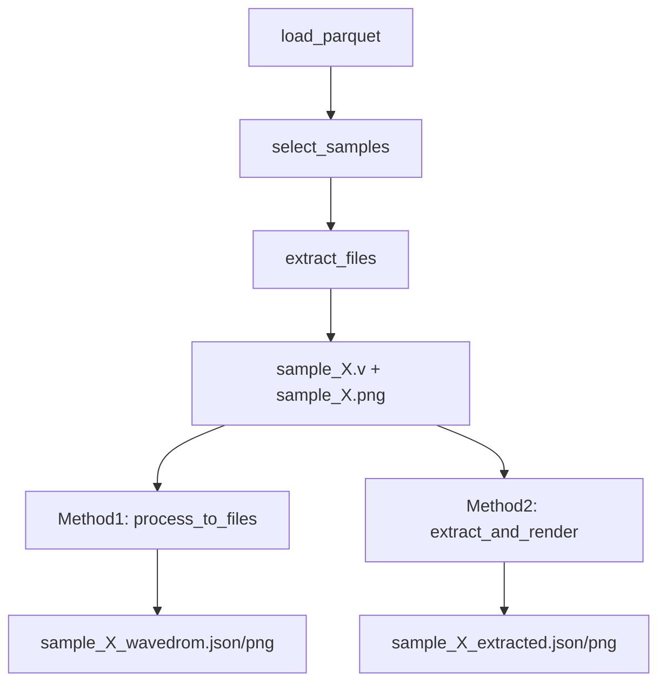

# 完整样例生成与信号一致性验证计划

## 当前状态总结

第二阶段的代码修改已完成：

- [verilog_parser.py](verilog_parser.py) 第27-42行: `Port.get_full_name()` 已实现
- [vcd_to_wavedrom.py](vcd_to_wavedrom.py) 第220-236行: `WaveDromGenerator` 已增强
- [convert_dataset.py](convert_dataset.py) 第157-161行: 已传递 `port_definitions`

需要创建的是 `generate_samples.py` 脚本。

## 任务 1: 创建 generate_samples.py 脚本

**功能设计**



**核心功能**

1. **从 parquet 加载数据**: 读取 `verilog-wavedrom/data/` 下的 parquet 文件
2. **选取样例**: 支持随机选取或指定数量
3. **提取原始文件**:

   - `text` 字段 -> `sample_X.v` (Verilog 代码)
   - `image` 字段 -> `sample_X.png` (原始波形图)

4. **协调两种方法生成**:

   - 方法一: 调用 `VerilogPipeline.process_to_files()`
   - 方法二: 调用 `VisionAIExtractor.extract_and_render()`

**依赖的现有模块**

- [convert_dataset.py](convert_dataset.py) 中的 `VerilogPipeline.process_to_files()` (第83-126行)
- [image_to_wavedrom.py](image_to_wavedrom.py) 中的 `VisionAIExtractor.extract_and_render()` (第254-305行)

**脚本结构**

```python
# generate_samples.py

class SampleGenerator:
    def __init__(self, data_dir, output_dir):
        self.data_dir = data_dir
        self.output_dir = output_dir
        self.pipeline = VerilogPipeline()
    
    def load_parquet_samples(self, count: int, seed: int = None):
        """从 parquet 加载指定数量的样例"""
        pass
    
    def extract_original_files(self, sample, sample_name):
        """提取 .v 和 .png 原始文件"""
        pass
    
    def run_method1(self, verilog_code, sample_name):
        """方法一: 仿真生成 WaveDrom"""
        pass
    
    def run_method2(self, image_path, sample_name):
        """方法二: 图像提取 WaveDrom"""
        pass
    
    def generate(self, count: int):
        """主生成流程"""
        pass

def main():
    parser = argparse.ArgumentParser()
    parser.add_argument('--count', type=int, default=15)
    parser.add_argument('--output', type=Path, default='sample_images/')
    # ...
```

## 任务 2: 验证信号一致性功能

**验证方法**

1. 生成 1-2 个测试样例
2. 检查生成的 `_wavedrom.json` 文件:

   - 信号名称是否包含位宽范围 (如 `in[127:0]`)
   - 信号顺序是否与 Verilog 端口定义顺序一致

3. 目视比较 `_wavedrom.png` 与原始 `sample_X.png`

**预期结果示例**

优化前:

```json
{"signal": [{"name": "in", ...}, {"name": "out", ...}]}
```

优化后:

```json
{"signal": [{"name": "in[127:0]", ...}, {"name": "select[6:0]", ...}]}
```

## 输出文件结构

```
sample_images/
├── sample_1.v              # 原始 Verilog
├── sample_1.png            # 原始波形图
├── sample_1_wavedrom.json  # 方法一输出
├── sample_1_wavedrom.png   # 方法一渲染
├── sample_1_extracted.json # 方法二输出
├── sample_1_extracted.png  # 方法二渲染
└── ...
```

## 命令行使用

```bash
# 生成 15 个完整样例
python generate_samples.py --count 15 --output sample_images/

# 仅生成原始文件（不运行方法一和方法二）
python generate_samples.py --count 5 --extract-only

# 仅运行方法一
python generate_samples.py --method1-only
```